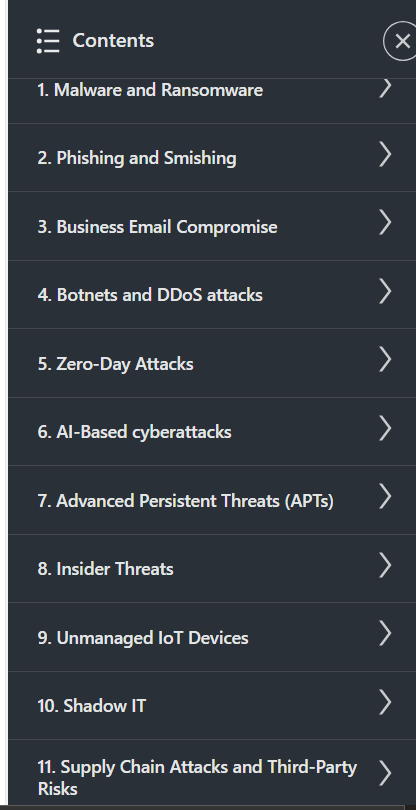

# 🛡️ The Cybersecurity Threat Landscape – LinkedIn Learning  

    

This repository contains **notes, labs, projects, case studies, and certificate of completion** for the *The Cybersecurity Threat Landscape* course on **LinkedIn Learning**.  
The program explores the **evolving threat landscape, attack vectors, vulnerabilities, risk assessment, defense strategies, and future challenges in cybersecurity**.  

---

## 📚 Notes  

- 📄 [`01-introduction.md`](./notes/01-introduction.md) – Course introduction  
- 📄 [`02-common-threats.md`](./notes/02-common-threats.md) – Common threats overview  
- 📄 [`03-attack-vectors.md`](./notes/03-attack-vectors.md) – Attack vectors explained  
- 📄 [`04-risk-and-impact.md`](./notes/04-risk-and-impact.md) – Risk & business impact  
- 📄 [`05-defense-strategies.md`](./notes/05-defense-strategies.md) – Defense strategies  
- 📄 [`06-future-of-cybersecurity.md`](./notes/06-future-of-cybersecurity.md) – Future of cybersecurity  

---

## 🧪 Labs  

- 🌐 [`network-vulnerability-lab.md`](./labs/network-vulnerability-lab.md) – Identifying network vulnerabilities  
- 🎣 [`phishing-detection-lab.md`](./labs/phishing-detection-lab.md) – Phishing detection exercise  
- 📊 [`risk-assessment-lab.md`](./labs/risk-assessment-lab.md) – Performing a risk assessment  
- 🔍 [`threat-analysis-lab.md`](./labs/threat-analysis-lab.md) – Threat analysis in practice  

---

## 🏗️ Projects  

- 🛡️ [`network-hardening-project.md`](./projects/network-hardening-project.md) – Build a network hardening plan  
- 🎣 [`phishing-awareness-campaign.md`](./projects/phishing-awareness-campaign.md) – Phishing awareness project  
- 📑 [`threat-report-project.md`](./projects/threat-report-project.md) – Write a cybersecurity threat report  

---

## 🔬 Extras  

- 📑 [`case-studies.md`](./extras/case-studies.md) – Real-world threat case studies  
- 📚 [`resources.md`](./extras/resources.md) – Additional references and resources  
- 📆 [`timeline.md`](./extras/timeline.md) – Learning timeline  

---

## 📖 Docs  

- 📘 [`glossary.md`](./docs/glossary.md) – Glossary of cybersecurity terms  
- 📘 [`index.md`](./docs/index.md) – Repository index  
- 📘 [`references.md`](./docs/references.md) – References used in this repo  
- 📘 [`roadmap.md`](./docs/roadmap.md) – Learning roadmap  
- 📘 [`syllabus.md`](./docs/syllabus.md) – Course syllabus  

---

## 📸 Screenshots  

| Content | Screenshot |
|---------|------------|
| 📑 Course Overview |  |
| 🏫 Course Details |  |

---

## 📜 Certificate  

🎓 [`The Cybersecurity Threat Landscape`](./cert/CertificateOfCompletion_The%20Cybersecurity%20Threat%20Landscape.pdf)  

---

## 📝 Personal Review  

This course provided **a deep dive into today’s cybersecurity threats**.  
The **labs on phishing detection and risk assessment** helped reinforce practical skills, while the **threat analysis module** improved my ability to assess and communicate risks effectively.  

It is a valuable program for anyone looking to **understand the big picture of cyber threats** and prepare strategies for defense.  

---

## ✍️ Author  

**Thành Danh** – Red Team Learner & Security Researcher  

- GitHub: [@ngvuthdanhh](https://github.com/ngvuthdanhh)  
- Email: ngvu.thdanh@gmail.com  

---

## 📄 License  

This project is licensed under the terms of the **MIT License**.  
See [`LICENSE`](./LICENSE) for details.  

© 2025 ngvuthdanhh. All rights reserved.  
